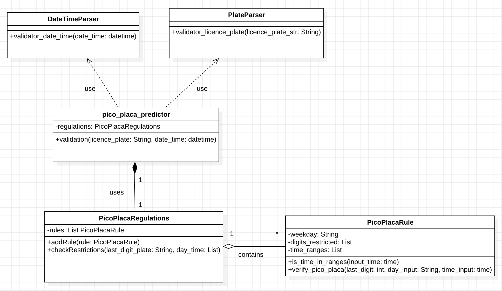

# PicoPlaca

A command-line tool to check if a vehicle is restricted from circulation according to the "Pico y Placa" traffic regulations in Ecuador.

## Description

Imagine that during the busiest times of day in Ecuador, not all cars can be on the road at once. To manage this, there's a rule called "Pico y Placa."
This Python program tells you if your car is allowed to be out on the street at a specific time. You give it three pieces of information:
- The last digit of your license plate
- The day you want to use your car: Monday, Tuesday, Wednesday... each day has its own restrictions.
- The time you plan to be out: There are specific hours when the restrictions are active.

In the end, PicoPlaca gives you a clear answer: Your vehicule is restricted or not
It's a useful tool for planning your trips and knowing whether or not you can use your vehicle on a specific day and time according to Ecuadorian regulation

## "Pico y placa" restrictions

The current implementation follows these restriction rules:

| Day of Week | Restricted Plate Last Digits | Restricted Hours             |
|-------------|-------------------------------|------------------------------|
| Monday      | 1, 2                          | 07:00–09:30 and 16:00–19:30 |
| Tuesday     | 3, 4                          | 07:00–09:30 and 16:00–19:30 |
| Wednesday   | 5, 6                          | 07:00–09:30 and 16:00–19:30 |
| Thursday    | 7, 8                          | 07:00–09:30 and 16:00–19:30 |
| Friday      | 9, 0                          | 07:00–09:30 and 16:00–19:30 |
| Saturday & Sunday | —                      | No restrictions             |

## Installation

Clone the repository to your local machine:

```bash
git clone https://github.com/your-username/PicoPlaca.git](https://github.com/xaviercarpio13/Pico-y-Placa-SB-Exercise.git
```

## Run Program
### Prerequisites
Python 3.5 or higher

## Command
To run the program, execute the following code in the root of the project
```bash
python3 cli.py --plate XXX-#### --datehour YYYY-MM-DD-HH:MM
```
### Parameters
--plate: License plate number in format XXX-#### (required)

--datehour: Combined date and time in format YYYY-MM-DD-HH:MM (required)

## Project Structure
```
PICO_PLACA/
├── cli.py                                # Main CLI entry point
├── core/
│   ├── pico_placa_rule.py                # Defines restriction rules per day and do the math to know if a vehicule is restricted or not
│   ├── pico_placa_regulations.py         # Holds and manages multiple rules
│   └── pico_placa_predictor.py           # Main predictor logic
├── img/
│   ├── classdiagram.mdj                  # Class diagram made in StarUML
│   └── PicoPlaca_ClassDiagram.png        # Image of the class diagram to attach it in the README file
├── tests/
│   ├── test_datetime_parser              # Unit tests for user's input of date and time
│   ├── test_pico_placa_rule              # Unit and integration tests
│   └── test_plate_parser                 # Unit tests for user's input of licence plate
├── utils/
│   └── date_parser.py                    # Validates user's input of date and time and return them in the correct format
│   └── plate_parser                      # Validates user's input of licence plate and return the last digit of interest

```

## Testing
### Run all tests
```bash
python3 -m unittest discover -s tests
```
### Run a specific test
```bash
python -m unittest tests.test_pico_placa_rule
python -m unittest tests.test_datetime_parser
python -m unittest tests.test_plate_parser
```

These tests help to cover:
- Valid and invalid license plates
- Time and date parsing
- Restrictions during boundary hours
- Edge cases and incorrect inputs
- Day-based rule validation

## Class diagram




## Author

**Copyright (c) 2025 Xavier Andres Carpio Layedra**
All rights reserved. 


  


